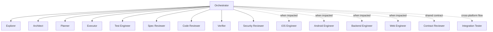

# Agent Topology

## Permanent core, temporary specialists

A permanent agent for every language and platform creates duplicated context,
conflicting edits, and unnecessary cost. The framework keeps coordination and
quality roles permanent while loading implementation specialists only when a
task's platform impact requires them.

## Separation of duties

- Planning and implementation are separate responsibilities.
- Production implementation and test design should be separated when the task
  risk justifies the cost.
- Specification review precedes code-quality review.
- Verification is independent from repair.
- An agent may report concerns outside its lane but must not silently assume a
  different role.

## Parallelism policy

Parallel work is allowed only when:

- File ownership does not overlap.
- Shared contract versions are fixed before consumer implementation.
- Each worker has a complete task envelope.
- Integration order is explicit.
- A single verifier evaluates the integrated result.

Parallel work is not appropriate for tightly coupled migrations, unresolved
architecture choices, shared generated files, or a task whose acceptance
criteria are still changing.

## Model diversity

Using different model families for implementation and review may reduce shared
blind spots, but it is an optional defense. It does not replace deterministic
tests, least privilege, or human approval for high-impact changes.
