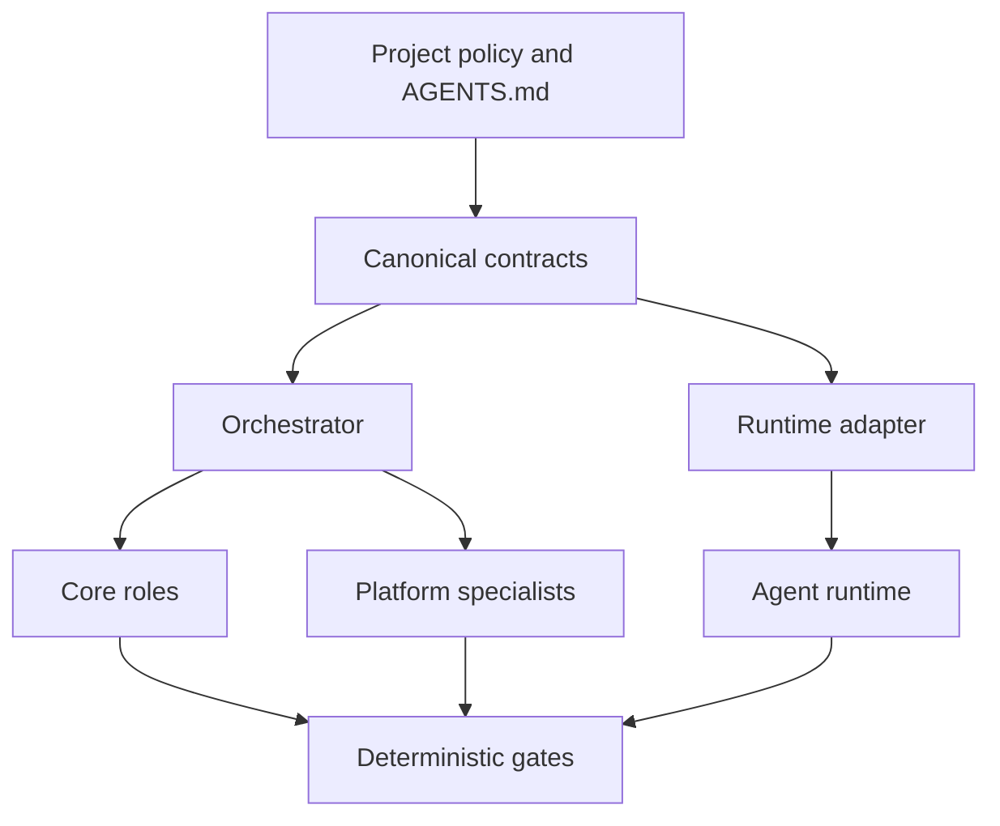

# Architecture Overview

## Goals

The framework separates durable collaboration policy from runtime-specific
execution. A consumer repository should be able to switch models, IDEs, or
agent runtimes without rewriting its specifications, role boundaries, or audit
history.

## Logical layers



### Policy layer

Defines project boundaries, protected files, commands, approval requirements,
and sources of truth.

### Contract layer

Defines role manifests, task envelopes, findings, verdicts, hook events, and
platform profiles. Contracts are versioned and validated with JSON Schema.

### Orchestration layer

Routes structured work between roles and enforces lifecycle transitions. It
does not replace deterministic policy or perform project implementation.

### Specialist layer

Provides temporary platform expertise. Specialists share the same task
envelope and acceptance criteria but receive platform-specific path and command
context.

### Gate layer

Executes schema validation, linting, tests, security checks, and acceptance
checks independently of model assertions.

### Adapter layer

Translates canonical role and skill definitions into runtime discovery paths,
tool names, and lifecycle events. Adapter output is generated and disposable.

## Dependency rule

Dependencies point inward:

```text
Runtime adapter -> canonical contracts -> project policy
```

Canonical contracts must not import or depend on a runtime adapter.

## State model

Each task progresses through explicit states:

```text
accepted
  -> explored
  -> planned
  -> plan_approved
  -> implementing
  -> reviewing
  -> verifying
  -> completed | rework | blocked
```

Transitions require artifacts, not conversation claims. For example,
`reviewing -> verifying` requires review verdicts; `verifying -> completed`
requires a PASS verdict with fresh evidence.
